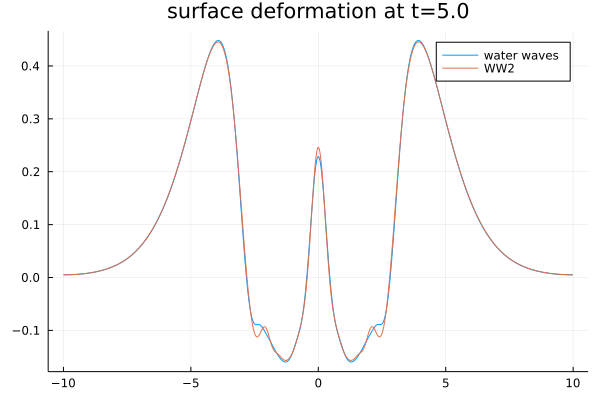
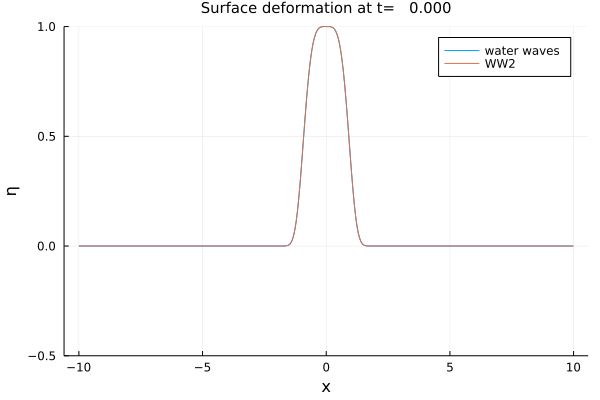

# WaterWaves1D.jl

[](https://github.com/WaterWavesModels/WaterWaves1D.jl/actions)
[](https://waterwavesmodels.github.io/WaterWaves1D.jl/stable/)
[](https://waterwavesmodels.github.io/WaterWaves1D.jl/dev/)
[](https://codecov.io/gh/WaterWavesModels/WaterWaves1D.jl)

## Installation

```julia
(v1.7) pkg> add https://github.com/WaterWavesModels/WaterWaves1D.jl.git
using WaterWaves1D
```

## Overview

`WaterWaves1D.jl` is a [Julia](https://julialang.org/) package providing a framework to study and compare several models for the propagation of unidimensional surface gravity waves (a.k.a. ["water waves"](https://waterwavesmodels.github.io/WaterWaves1D.jl/stable/background/#Water-waves)).

Several models are already implemented, including ([but not limited to](https://waterwavesmodels.github.io/WaterWaves1D.jl/stable/background/#Models)) the so-called water waves system, its truncated spectral expansion, the Green-Naghdi system, the Matsuno system, and so on. You may easily add your favorite one to the gang: see the [how-to guide](https://waterwavesmodels.github.io/WaterWaves1D.jl/stable/how-to/#build-your-model).

## Documentation

See [here](https://waterwavesmodels.github.io/WaterWaves1D.jl/stable/).


## Example

A simple example of a typical use of the package can be found below. More advanced examples are available at the [examples](examples/) and [notebooks](notebooks/) folders.


Gather parameters of the problem.
```julia
param = (
    # Physical parameters. Variables are non-dimensionalized as in Lannes, The water waves problem, isbn:978-0-8218-9470-5
    μ  = 1,     # shallow-water dimensionless parameter
    ϵ  = 1/4,   # nonlinearity dimensionless parameter
    # Numerical parameters
    N  = 2^11,  # number of collocation points
    L  = 10,    # half-length of the numerical tank (-L,L)
    T  = 5,     # final time of computation
    dt = 0.01,  # timestep
                );
```

Define initial data (here, a "heap of water").
```julia
z(x) = exp.(-abs.(x).^4); # surface deformation
v(x) = 0*exp.(-x.^2);     # zero initial velocity
init = Init(z,v);         # generate the initial data with correct type
```

Set up initial-value problems for different models to compare.
```julia
# Build models
model_WW=WaterWaves(param,verbose=false) # The water waves system
model_WW2=WWn(param;n=2,dealias=1,δ=1/10) # The quadratic model (WW2)
# Build problems
problem_WW=Problem(model_WW, init, param) ;
problem_WW2=Problem(model_WW2, init, param) ;
```

Integrate in time the initial-value problems.
```julia
solve!([problem_WW problem_WW2]);
```

Plot solutions at final time.
```julia
using Plots
plot([problem_WW, problem_WW2])
```


Generate an animation.
```julia
anim = @animate for t = LinRange(0,5,101)
    plot([problem_WW, problem_WW2];T=t,ylims=(-0.5,1))
end
gif(anim, "Example.gif", fps=15)
```



## Developers

`WaterWaves1D.jl` is being developed by [Vincent Duchêne](https://perso.univ-rennes1.fr/vincent.duchene/) and [Pierre Navaro](https://github.com/pnavaro).
