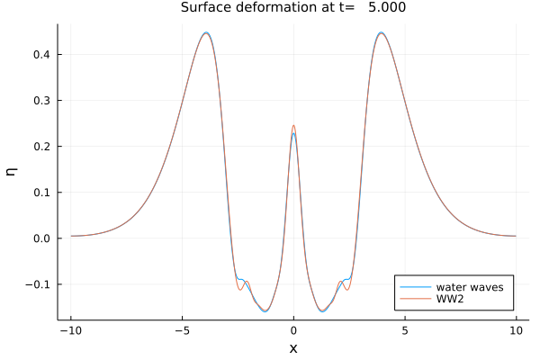

# Summary

The propagation of water waves is a physical phenomenon that is
difficult to calculate by numerical simulations. There are many
models to solve the equations that model this phenomenon. Each model
has advantages and disadvantages. It is interesting to be able to
compare them easily from a single interface.


# Statement of need

WaterWaves1D.jl is a Julia package providing a framework to study
and compare several models for the propagation of unidimensional
surface gravity waves.

Several models are already implemented, including the so-called
water waves system, its truncated spectral expansion, the Green-Naghdi
system, the Matsuno system, and so on.


# Mathematics

The propagation of waves at the surface of a layer of water is
typically modelled using the incompressible Euler equations inside
the fluid domain, and suitable boundary conditions at the boundaries
(accounting for the impermeable bottom and the free surface).

In an idealized situation where the only external force acting on
the fluid is due to the (constant) vertical gravity acceleration,
that the fluid is homogeneous and the flow is potential (that is
irrotational), the system can be written in closed form as two
evolution equations.

$$
  \begin{cases}
  \partial_t\eta-\tfrac{1}{\mu\nu} G^\mu[\epsilon\eta]\psi=0,\\
  \partial_t\psi+\eta+\frac{\epsilon}{2\nu}(\partial_x\psi)^2-\tfrac{\epsilon\mu}{2\nu}\frac{(\frac{1}{\mu} G^\mu[\epsilon\eta]\psi+\epsilon(\partial_x\eta)(\partial_x\psi))^2}{1+\mu\epsilon^2(\partial_x\eta)^2}=0,
  \end{cases}
$$

where, by definition,

$$
G^\mu[\epsilon\eta]\psi=\big(\partial_z\Phi-\mu\epsilon(\partial_x\eta)(\partial_x\phi)\big)\big\vert_{z=\epsilon\eta}
$$

with $\phi$ being the unique solution to the elliptic boundary value problem

$$
\begin{cases}
\mu \partial_x^2 \phi + \partial_z^2 \phi=0& \text{ in } \{ (x,z) \colon   -1<z<\epsilon\eta(x) \} , \\
\phi = \psi & \text{ on } \{ (x,z) \colon   z=\epsilon\eta(x) \} ,\\
\partial_z \phi =0 & \text{ on } \{ (x,z) \colon z=-1 \} .
\end{cases}
$$

In the above formula,

- $t,x,z$ represent respectively the (rescaled) time, horizontal and vertical space variables.
- $\eta$ represents the *surface deformation*: the free surface may be parametrized as $\{(x,z) :  z=\epsilon\eta(x)\}$.
- $\psi$ is the trace of the *velocity potential* at the surface. In models we generally prefer to use $v=\partial_x\psi$ as the second unknown, since $\psi$ is not necessarily decaying at (spatial) infinity even in finite-energy situations.
- $\epsilon$ is the *nonlinearity* dimensionless parameter, defined as the ratio of the maximal amplitude of the wave to the depth of the layer.
- $\mu$ is the *shallowness* dimensionless parameter, defined as the square of the ratio of the depth of the layer to the typical horizontal wavelength of the flow.
- $\nu$ is a scaling parameter: in shallow water situations one typically sets $\nu=1$ while in deep water situations it is wise to set $\nu=1/\sqrt{\mu}$. In the latter case, $\epsilon\sqrt{\mu}$ being the *steepness* of the wave plays an important role. Especially, taking formally the limit $\mu \rightarrow \infty$ one obtains the infinite-depth situation where the wave steepness is the only remaining parameter.

# Example

In this example we shall observe the disintegration of a heap of water using the water-waves system as well as a second-order small-steepness model. 

## Set up the initial-value problem

First we define physical parameters of our problem. Variables are non-dimensionalized as 
in [@Lannes:2013].

```julia
using WaterWaves1D

param = (
    μ  = 1,     # shallow-water dimensionless parameter
    epsilon  = 1/4,   # nonlinearity dimensionless parameter
    # Numerical parameters
    N  = 2^10,  # number of collocation points
    L  = 10,    # half-length of the numerical tank (-L,L)
    T  = 5,     # final time of computation
    dt = 0.01,  # timestep
                )
```

Now we define initial data solver (the "heap of water"). The function
`Init` may take either functions, or vectors (values at collocation
points) as arguments.

```julia
z(x) = exp.(-abs.(x).^4) # surface deformation
v(x) = zero(x)           # zero initial velocity
init = Init(z,v)         # generate the initial data with correct type
```

Then we build the different models `WaterWaves` and `WWn` to compare:

```julia
WW_model  = WaterWaves(param) # The water waves system
WW2_model = WWn(param; n = 2, dealias = 1, δ = 1/10) # The quadratic model (WW2)
```

Finally we set up initial-value problems. Optionally, one may specify
a `time solver` to `Problem`, by default the standard explicit
fourth order Runge Kutta method is used.

```julia
WW_problem  = Problem(WW_model,  init, param)
WW2_problem = Problem(WW2_model, init, param)
```

## Solve the initial-value problem and generate graphics

```julia
using Plots

solve!([WW_problem WW2_problem])

plot([WW_problem, WW2_problem], legend = :bottomright)
```

{ width=80% }


# Citations

[@Duchene:2020]


# References
