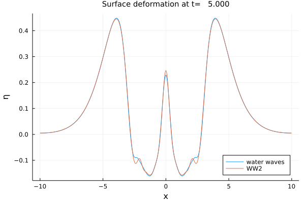
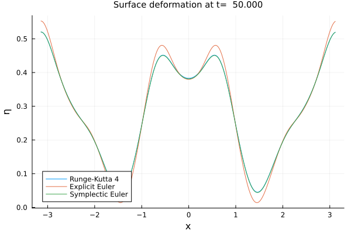

# Summary

`WaterWaves1D.jl` is a software that aims at facilitating the study and comparison of models for the propagation of water waves in an idealised framework. 
Several models are already implemented, including the so-called water waves system, many major simplified models as well as state-of-the art models of the litterature.

`WaterWaves1D.jl` makes use of the capabilities of the Julia programming language [@BezansonEdelmanKarpinskiEtAl17] to offer a highly efficient code with a friendly user interface. The architecture of the package has been designed to ease the inclusion of new models, the monitoring and comparison of models on a common ground, and pleasant illustration options.

The key ingredients of the numerical strategy are the Fourier spectral approach for the spatial discretization, and explicit Runge-Kutta methods for time integration. Additionnally, some models involve solving elliptic equations, for which GMRES iterative methods have been implemented.


# Statement of need

The propagation of waves at the surface of water under the action of gravitational forces (herein referred to as *water waves*) is arguably the physical phenomenon for which the most models have been proposed and are currently in use [@Lannes; @MM4WW]. This is partly due to the variety of *regimes* describing physical situations —such as shallow water, small-slope, long waves, wave packets— that can be considered and drive the modelling procedure. Even within the same physical regime, different approaches —Boussinesq–Rayleigh expansions, variational methods, spectral methods to name a few— yield different models, and *a posteriori* adjustments such as the BBM trick or the Nwogu approach further expand the range of models proposed in the literature.
Yet all these models are built from the same "master equations", and in principle can easily be compared.
The Julia package `WaterWaves1D.jl` provides a unified groundwork for the study and comparison of models.


# Description of some models

As a peek into the currently-implemented models in the package we describe some of the key models that are currently implemented.
The complete list is described in the [documentation of the package](https://waterwavesmodels.github.io/WaterWaves1D.jl/dev/background/).

## The water-waves equations

This is the "master equations" from which all other models are constructed. Considering potential incompressible flows and constant vertical gravity acceleration, the free-surface Euler equations can be written using the so-called Zakharov–Craig–Sulem formulation as evolution equations for two scalar quantities depending on time and horizontal space variables, the first one describing the surface elevation and the second one the trace of the velocity potential at the surface. These Hamiltonian equations involve a Dirichlet-to-Neumann operator that entail a Laplace problem in the fluid domain.
Fortunately, within the framework of one-dimensional horizontal space (either periodic or on the real line) and flat bottoms, the conformal mapping approach of @DyachenkoKuznetsovSpectorEtAl96 allows to rewrite the system using only nonlinear pointwise operations or Fourier multipliers (that is pointwise operations in Fourier space). This allows (by means of Fourier spectral methods based on Fast Fourier Transform) for a very efficient strategy for the numerical approximation of the system. Documented drawbacks of the strategy (see *e.g.* @AmbroseCamassaMarzuolaEtAl22) are that the physical quantities are by design computed on a non-uniform grid of collocation points, and that the method suffers from  anti-resolution for steep waves. Concerning the first issue, we implement interpolation tools for comparison with other models that are solved on uniform grids.


The water-waves equations are formulated using dimensionless variables, and involve three dimensionless variables that are the crucial quantities in the development of simplified models:

- $\epsilon$ is the *nonlinearity* dimensionless parameter, defined as the ratio of the maximal amplitude of the wave to the depth of the layer.
- $\mu$ is the *shallowness* dimensionless parameter, defined as the square of the ratio of the depth of the layer to the typical horizontal wavelength of the flow.
- $\nu$ is a scaling parameter: in shallow water situations one typically sets $\nu=1$ while in deep water situations it is advisable to set $\nu=1/\sqrt{\mu}$. 

In the deep water case, $\epsilon\sqrt{\mu}$ being the *steepness* of the wave plays an essential role. Especially, taking formally the limit $\mu \rightarrow \infty$ one obtains the infinite-depth situation where the wave steepness is the only remaining parameter. Our code covers both the finite-depth and infinite-depth situations. All implemented models use consistent dimensionless variables, and their accuracy depending on the size of dimensionless parameters can easily be monitored.

## Boussinesq-type models

The derivation of Boussinesq-type models is typically based on the long-waves assumption ($\epsilon\ll1$ and $\mu\ll1$), discarding contributions that are both nonlinear and dispersive. By means of the BBM trick [@BonaSmith76] and changes of variables reminiscent of the Nwogu approach [@Nwogu93], a full three-parameters family of systems have been derived in @BonaChenSaut02. Relevant choices of the parameters allow for instance to improve dispersive properties of the model. Alternatively, fully dispersive Boussinesq-type models have been proposed for instance in @DinvayDutykhKalisch19. 

Our code implements both type of models in the same framework, focusing on the ones that enjoy a Hamiltonian formulation and a direct interpretation in terms of the canonical Hamiltonian variables at stake in the water-waves equations.

## Serre–Green–Naghdi-type models

The Serre–Green–Naghdi equations [@Serre53; @GreenNaghdi76] is a fully nonlinear versions of Boussinesq models, where only high-order dispersive contributions are discarded. 

This improvement comes with a high-price as a differential elliptic problem reminiscent of the Dirichlet-to-Neumann operator needs to be solved at each timestep. In order to lower the numerical cost, the package offers the use of the Krylov subspace iterative technique GMRES with a suitable preconditioner, as described in @DucheneKlein22.

## Augmented "hyperbolized" systems

In order to cope with the cost of solving the elliptic problem associated with the Serre–Green–Naghdi equations, a strategy based on the reformulation of the equations as hyperbolic equations with a constraint, and suitable approximation through constraint-relaxation has been recently proposed by several authors [@FavrieGavrilyuk17; @EscalanteDumbserCastro19; @GuermondPopovTovarEtAl19].

The package provides an educated implementation of these approaches, involving in particular different choices for the initiation of augmented variables, that allows direct and in-depth monitoring of the validity of the strategy.

## The Choi model

The Choi model is a hierarchy of systems based on the Boussinesq–Rayleigh expansion recently proposed in @Choi22. 
Contrarily to alternative models such as the ones derived in @Matsuno15,
none of the systems in the hierarchy suffers from modal instabilities and, moreover, their linear dispersion relation converges towards the one of the water waves system as the rank of the model increases.

However, by design, the models involve differential operators of increasing order with the rank of the model, which is why the current implementation is restricted to low-rank systems ($N\in\{0,1,2\}$).

## The Isobe–Kakinuma model

The Isobe–Kakinuma model [@Isobe94; @Kakinuma01] is a hierarchy of systems derived by means of Luke's Lagrangian structure of the water-waves equations. It has been proved [@DucheneIguchi21] that the systems enjoy a canonical Hamiltonian structure inherited from Zakharov's Hamiltonian strcuture of the water-waves equations.

Integrating in time these models involve, as for the Serre–Green–Naghdi equations, solving at each timestep an differential elliptic system. The size of the elliptic system —and hence the numerical costs— increases with the rank of the system in the hierarchy. The current implentation is currently limited to rank $N=1$.

## The high-order spectral model

Up to now all models we decribed are based on the assumption of shallow water ($\mu\ll 1$) and in particular are not suitable for the description of deep water waves. The high-order spectral model hierarchy [@DommermuthYue87; @WestBruecknerJandaEtAl87; @CraigSulem93] by is based on Taylor expansions using powers of the surface deformation, assuming small wave steepness, $\epsilon\sqrt{\mu}\ll 1$. 

It has been observed that high-order spectral systems may suffer from spurious high-frequency amplification, and the code implements a regularization proposed in @DucheneMelinand24.


The current code implements the systems up to quartic nonlinearity. 


## Unidirectional models

Standard unidirectional models such as the Korteweg–de Vries, Benjamin–Bona–Mahony and Whitham equations are typically derived assuming unidirectional propagation. They can however be used as building blocks for the propagation of general (unidimensional) waves through the superposition of two counterpropagating waves, assuming that initial data are sufficiently localized [@Lannes; @Emerald21].


# Numerical strategy

The numerical strategy that is employed to approximate solutions of the implemented models is fairly standard, as attention was mostly given on the unifying approach.

`WaterWaves1D.jl` is designed to use the method of lines, that is the full space-time discretization is decomposed into (i) spatial semidiscretization and (ii) numerical integration of the resulting ODE system. As such a problem is defined by the spatial semidiscretization associated with the system of partial differential equations, the initial data and the time integration scheme.

A common feature of all the implemented models is that they involve combinations of pointwise operations in physical space, and Fourier multipliers (that is multiplication in Fourier space). In our periodic framework, this calls for the use of Fourier spectral methods [@Trefethen00] for spatial semidiscretization. In most cases the (optional) application of dealiasing and/or Krasny filters is offered to the user.

Some models involve solving a discretized elliptic problem, that is a linear equation system. In that case we implemented as an addition to standard solvers the Krylov subspace iterative technique GMRES with suitable preconditioners.

The architecture of the package allows in principle any solver for time integration provided that the semi-discretized model supplies the necessary operators. By construction, all implemented models can be equipped with any Runge–Kutta methods, and the standard explicit Euler and fourth order Runge-Kutta schemes are provided. Additionnally, as a proof-of-concept, the symplectic Euler [@HairerLubichWanner03] and the exponential Euler [@HochbruckOstermann10] schemes are implemented for a selection of models.

In the same spirit, while the name of the package clearly indicates a disposition towards unidimensional waves, this is by no means an absolute restriction of the package architecture and the two-dimensional shallow-water system has been implemented.

# Features

The package provides users with built-in analysis tools, such as the evaluation of conserved quantities (mass, momentum, energy) for monitoring the accuracy of the discrete approximation.

Built-in visualization tools by means of plot recipes building upon the standard package `Plots.jl` provide easy access to illustrations and preliminary investigation. In particular the users have immediate access to the computed solutions at given time either at computed collocation points or on any specified grids through interpolation, as well as Fourier mode coefficients.

The package implements analytic formula for traveling waves of the Serre–Green–Naghdi equations, and numerically constructed solutions of the Whitham, Whitham–Boussinesq and Whitham–Green–Naghdi equations.

The package offers a tool for saving (raw) data to a local file, which can be loaded later for future analyses.

# Softwares environment

A multitude of softwares for water wave or ocean dynamics have been developed for different needs over many years, and we cannot aim at exhaustiveness in the following description. We focus below on recent (a few years old) Julia packages in the vicinity of our package, emphasizing scope differences. The main specificity of the `WaterWaves1D.jl` is the desire to to offer a common framework for different models in view of facilitating their comparison.

In that respect the most closely related package is arguably     `DispersiveShallowWater.jl` [@LampertWittensteinRanocha25]
which implements structure-preserving numerical methods for dispersive shallow water models, including  unidirectional models such as the Korteweg–de Vries and
the Benjamin–Bona–Mahony equations, as well as Boussinesq systems, the Serre–Green–Naghdi equations and its augmented "hyperbolized" system. Note that the implemented numerical methods include the Fourier spectral method but that for the purpose of structure preserving, Fast Fourier transform is avoided and as a consequence the Fourier spectral method is less competitive compared with other methods involving sparse matrices. 


Building on the numerical simulation framework for general conservation laws `Trixi.jl` [@Schlottke-LakemperGassnerRanochaEtAl25], `TrixiShallowWater.jl` [@WintersErsingRanochaEtAl25] provides a discontinuous Galerkin discretization of shallow water equations, including wetting and drying capabilities, sediment transport and variable densities through multilayer equations. While the standard shallow water equations with flat bottom is implemented in `WaterWaves1D.jl`, its primary interest lies in dispersive equations.

`SpectralWaves.jl` [@Paprota25] implements a model for the propagation of water waves over topography that has the same structure as the Isobe–Kakinuma model yet constructed through an expansion akin to high-order spectral models, using the Fourier spectral method.

`GeophysicalFlows.jl` [@ConstantinouWagnerSiegelmanEtAl21] is a package for geophysical fluid dynamics (2D periodic incompressible Navier-Stokes equation and quasi-geostrophic equations) that leverages the pseudo-spectral solver modules of the package `FourierFlows.jl` [@ConstantinouWagnerPaloczyEtAl25]. In Waterwaves1D.jl we have avoided using modules of `FourierFlows.jl` and built analogous ones in order to avoid dependencies.

We finally mention the package  `Oceananigans.jl` [@RamadhanWagnerHillEtAl20] that implements finite volume algorithms optimized for high-resolution simulations on GPUs for geophysical models adapted to large-scale ocean dynamics.

# Examples

## Models comparison

In this example we shall observe the disintegration of a heap of water using the water-waves system as well as a second-order small-steepness model. 

### Set up the initial-value problem

First we define physical parameters of our problem. Variables are non-dimensionalized as previously described.

```julia
using WaterWaves1D

param = (
    # Physical parameters.
    μ  = 1,     # shallow-water dimensionless parameter
    ε  = 1/4,   # nonlinearity dimensionless parameter
    # Numerical parameters
    N  = 2^10,  # number of collocation points
    L  = 10,    # half-length of the numerical tank (-L,L)
    T  = 5,     # final time of computation
    dt = 0.01,  # timestep
                )
```

Now we define initial data (the "heap of water"). The function `Init` may take either functions, or vectors (values at collocation points) as arguments.

```julia
z(x) = exp.(-abs.(x).^4) # surface deformation
v(x) = zero(x)           # zero initial velocity
init = Init(z,v)         # generate the initial data with correct type
```

Then we build the different models `WaterWaves` and `WWn` to compare:

```julia
WW_model  = WaterWaves(param) # The water waves system
WW2_model = WWn(param; n = 2, dealias = 1, δ = 1/10) # The quadratic model (WW2)
```

Finally we set up initial-value problems. Optionally, one may specify a time solver to `Problem` (see the next example), by default the standard explicit fourth order Runge Kutta method is used.

```julia
WW_problem  = Problem(WW_model,  init, param)
WW2_problem = Problem(WW2_model, init, param)
```

### Solve the initial-value problem

```julia
for problem in [WW_problem WW2_problem] solve!(problem) end
```

### Generate graphics
```julia
using Plots
plot([WW_problem, WW2_problem], legend = :bottomright)
```

{ width=80% }

## Solvers comparison

In this example we compare the results of different numerical solvers on the same problem. 

### Set up the initial-value problem

We define physical parameters of our problem.

```julia
using WaterWaves1D

param = ( 
      # Physical parameters.
      μ = 1/4,
			ε = 0.1,
      # Numerical parameters
      N  = 2^8, 	# number of collocation points
      L  = π,	# size of the mesh (-L,L)
      T  = 50,		# final time of computation
      dt = 0.001, # timestep
			ns = 50,   	# to save memory, data are stored every ns step
				);
```  

We set initial data (the "heap of water").

```julia
z(x) = exp.(-abs.(x).^4) # surface deformation
v(x) = zero(x)           # zero initial velocity
init = Init(z,v)         # generate the initial data with correct type
```

We build the model `WaterWaves`.

```julia
WW_model=WaterWaves(param)
```


Finally we set up initial-value problems with different time solvers. 

```julia
RK4_problem  = Problem(WW_model,  init, param, solver = RK4(WW_model), label = "Runge-Kutta 4")
Euler_problem = Problem(WW_model, init, param, solver = Euler(WW_model), label = "Explicit Euler")
Symplectic_Euler =  EulerSymp(WW_model,Niter=5,implicit=1)
Symplectic_problem = Problem(WW_model, init, param, solver = Symplectic_Euler, label = "Symplectic Euler")
```

### Solve the initial-value problem

```julia
for problem in [RK4_problem, Euler_problem, Symplectic_problem] solve!(problem) end
```

### Generate graphics
```julia
using Plots
plot([RK4_problem, Euler_problem, Symplectic_problem])
```

{ width=80% }


# References
